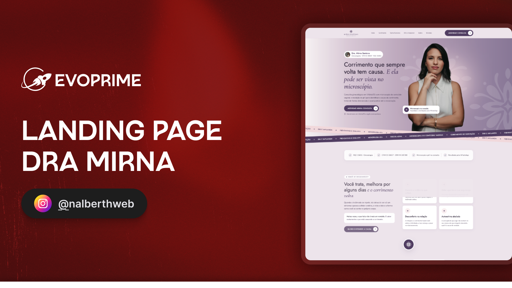

# Landing Page — Dra. Mirna Santana

[Tecnologias](#-tecnologias) | [Projeto](#-projeto) | [Layout](#-layout) | [Como executar](#-como-executar) | [Licença](#-licença)



## 🚀 Tecnologias

Este projeto foi desenvolvido com:

- [HTML5](https://developer.mozilla.org/pt-BR/docs/Web/HTML)
- [CSS3](https://developer.mozilla.org/pt-BR/docs/Web/CSS)
- [JavaScript](https://developer.mozilla.org/pt-BR/docs/Web/JavaScript)
- [Figma](https://www.figma.com/)

## 💻 Projeto

Landing page institucional da **Dra. Mirna Santana**, médica ginecologista em Vitória/ES. A página apresenta o atendimento, a investigação de corrimento de repetição com microscopia do conteúdo vaginal e outros cuidados oferecidos no consultório.

O conteúdo conduz a visitante da apresentação da Dra. Mirna até o agendamento pelo WhatsApp. A página inclui:

- Apresentação da consulta e das credenciais profissionais
- Explicação da microscopia e das etapas do atendimento
- Informações sobre anticoncepção, DIU e Implanon
- Serviços, diferenciais e apresentação da Dra. Mirna
- Galeria do consultório e perguntas frequentes
- Endereço, horários e mapa interativo do Google Maps
- Botões de contato integrados ao WhatsApp

## 🎨 Layout

O layout foi implementado a partir dos designs desktop e mobile no Figma, com tipografia, cores, imagens e componentes adaptados para diferentes tamanhos de tela.

- [Visualizar o design desktop no Figma](https://www.figma.com/design/upCoL6i9LzVC5u44eKi6Au/LANDING-PAGE---DRA-MIRNA?node-id=20011-16&m=dev)
- [Visualizar o design mobile no Figma](https://www.figma.com/design/upCoL6i9LzVC5u44eKi6Au/LANDING-PAGE---DRA-MIRNA?node-id=20025-351&m=dev)

Entre os recursos de interface estão o menu mobile, as faixas animadas, o acordeão de perguntas, as transições das imagens e as animações de entrada. O movimento é reduzido quando essa preferência está ativa no dispositivo.

## ▶️ Como executar

O projeto usa HTML, CSS e JavaScript puros, sem dependências ou etapa de build. Na raiz do repositório, inicie um servidor local:

```bash
python3 -m http.server 8000
```

Abra `http://localhost:8000/` no navegador.

## 📁 Estrutura do projeto

```text
DRA-MIRNA/
├── assets/
│   ├── css/          # Estilos, componentes e tokens visuais
│   ├── fonts/        # Fontes locais e licenças
│   ├── img/          # Fotografias e capa do README
│   ├── js/           # Interações da página
│   └── svg/          # Ícones e elementos gráficos
├── .gitignore
├── ASSETS.md         # Inventário de imagens e vetores
├── index.html        # Página principal
├── preview-componentes.html
└── README.md
```

## 📝 Licença

Projeto criado para uso institucional da Dra. Mirna Santana.
